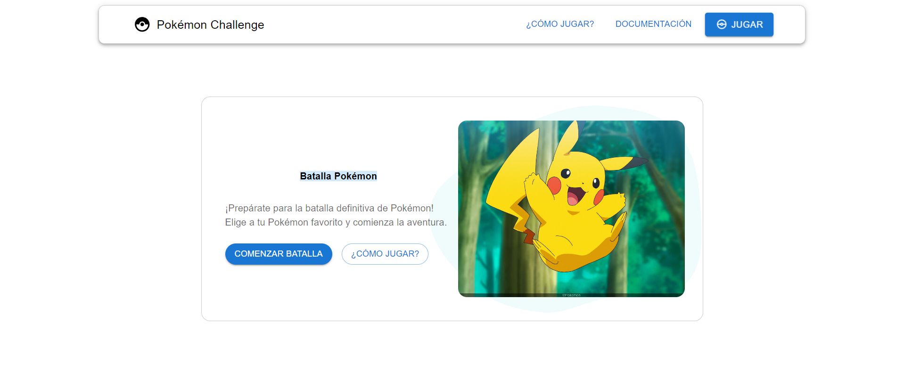
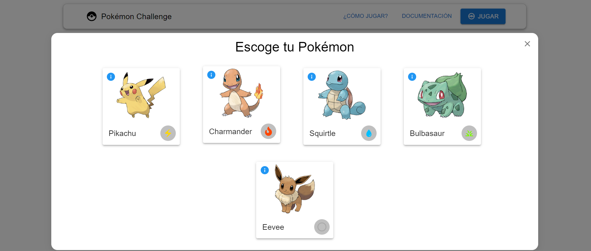
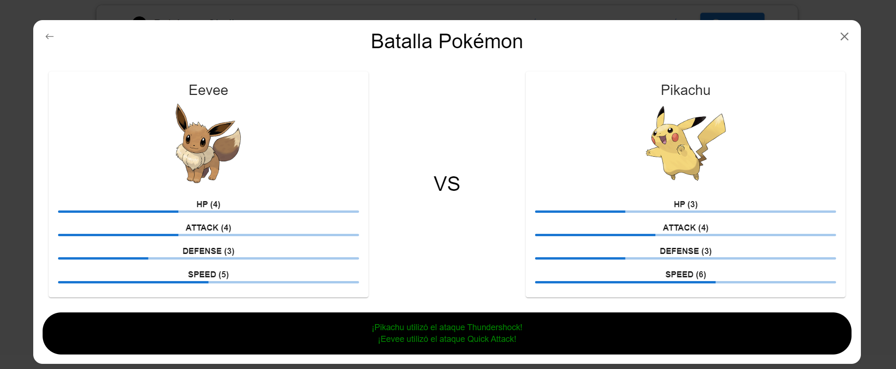
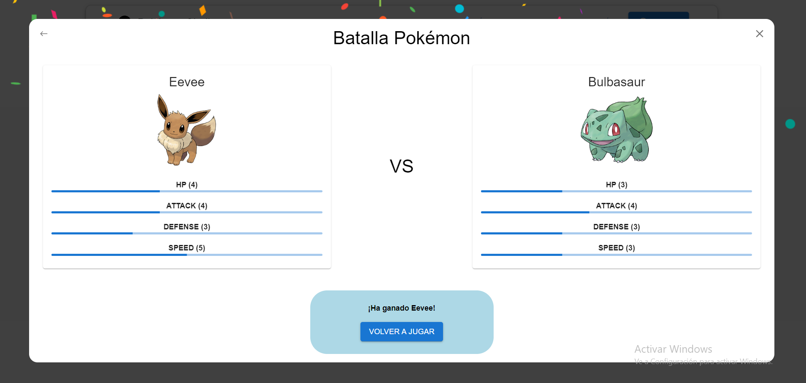

# 🔴 Challenge Pokemon

[Español](README.md)  / [English](README_EN.md) 

## 📖 About the project

This project is a **Pokemon battle game** where players can select their Pokemon and engage in strategic battles. It uses a specific algorithm to determine the winner based on the Pokemon's stats.

## 🧠 Battle Algorithm

- The Pokemon with the highest speed attacks first. If their speeds are equal, the Pokemon with the higher attack goes first.
- To calculate damage, subtract the defense from the attack (attack - defense). The difference is the damage. If the attack is equal to or less than the defense, the damage is 1.
- Subtract the damage from the HP.
- The Pokemon will take turns fighting. All turns will be calculated in the same request, so the endpoint must return the winner's data in the same call.
- The winner is the one who reduces the opponent's HP to zero.
- The type system has been implemented but it does not interact with the battle algorithm, it is only visual.

## 💻 Technologies used

Backend:
- **Framework:** NestJs
- **ORM:** Typeorm
- **Database:** Sqlite
- **Package manager:** Yarn

Frontend:
- **Library:** React
- **UI components:** MaterialUI
- **Package manager:** Yarn

## 🚀 How to deploy

### Clone the repository

1. Clone the repository from GitHub: `git clone https://github.com/DarioAlbor/ChallengePokemon.git`
2. Navigate to the project directory: `cd ChallengePokemon`

### Set up and start the server

1. Navigate to the server directory: `cd server`
2. Install dependencies: `yarn`
3. Generate the Pokemon database `pokemon.db` (if you want a new one, delete the current one): `yarn start seed`
4. Start the server: `yarn start`

### Set up and start the client

1. Navigate to the client directory: `cd client`
2. Install dependencies: `yarn`
3. Navigate to the directory `../utils/apiroutes.js` and modify `const baseurl = 'FOR EXAMPLE http://localhost:3000/pokemon';`
4. Start the client: `yarn start`

Enjoy!

## ✨ Deployed using

Frontend: [Vercel](https://vercel.com)
Backend: [Render](https://render.com)

## 📬 Contact

You can contact me through my [portfolio](https://darioalbor.dev.ar).

You can also contribute to the project by adding new ideas or lines of code. All help is welcome!

## 📸 Images

|  |  |
|:------------------------------------:|:------------------------------------------------:|
| Game Start                           | Choose Pokemon                                   |

|     |               |
|:------------------------------------:|:------------------------------------------------:|
| Battle                               | Victory                                         |
